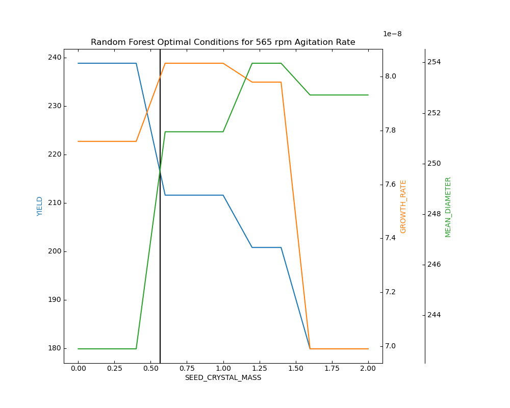

Github Repository: [MultipleOutputRegressions](https://github.com/MichelleChung-code/MultipleOutputRegressions)

Skills Used: [Python](https://www.python.org/){:target="_blank"}

## Project Objective

This project involved running a regression analysis on experimental data obtained from a crystallization lab. This was completed as part of the ENCH 551 course.  The experiment cooled an aqueous solution of supersaturated potassium chloride (KCl) to induce crystal formation. Data from nine experiments was collected to investigate the effects of agitation rate and seed crystal mass (independent variables) on crystal yield, growth rate, and mean diameter (dependent variables). The objective of the regression analysis was to determine the optimal experimental conditions that would maximize these attributes.

## Experimental Results

Experimental results obtained and used to run the regression analysis are tabulated below:

| Agitator Speed \($rpm$) | Seed Crystal Mass \($g$) | Yield \($g$) | Growth Rate \($m/s$) | Mean Diameter \($\mu m$) |
| :------------------: |:--------------------: | :-------: | :---------------: | :---------------: |
| 214 | 0 | 170.5448 | 6.7462E-08 | 218.577 |
| 214	| 1	| 231.2165 | 7.22231E-08	| 225.336 | 
| 214	| 2	| 171.36	| 5.82614E-08	| 178.28 | 
| 464	| 0	| 183.25	| 8.27043E-08	| 248.94 |
| 464	| 1	| 123.44	| 6.9377E-08	| 208.131 |
| 464	| 2	| 204.51	| 4.21397E-08	| 208.423 |
| 665	| 0	| 254.69	| 7.60032E-08	| 237.13 |
| 665	| 1	| 203.9458	| 8.31225E-08	| 257.264 |
| 665	| 2	| 164.6471	| 6.98147E-08	| 259.7106667 |

## Approach Summary

Three regression models were considered and run: linear regression considering interactions between independent variables, linear regression considering interactions between dependent variables, and a non-linear random forest regression.  The coefficient of determination (R2) was used to evaluate the fit of the models.  

In the models, three independent variables (yield, growth rate, and mean diameter) and two dependent variables were considered.

The multiple linear regression considering interactions between independent variables follows:
\\[ y_i=\beta_{i0}+ \beta_{i1} x_1+\beta_{i2} x_2+\beta_{i3} x_1 x_2 \\]

Where, 
- $ i $ is the dependent variable number of the given dependent variable. 
- $ y_i $ is the dependent variable 
- $ x_1 $  and $ x_2 $ are the independent variables, agitation rate (rpm) and seed crystal mass (g), respectively.  
- $ β_{i0} $  is the constant term
- $ β_{i1} $, $ β_{i2} $, and $ β_{i3} $ are the coefficients associated with each independent variable, with $ β_{i3} $ being associated with the interaction term.

The challenge with this first model is that the regression problem has been divided into a separate problem for each dependent variable to be predicted.  This assumes that the outputs are independent of each other.  The next linear model attempts to addressed this limitation.

The multiple linear regression considering interactions between dependent variables considers a linear sequence of models to produce outputs where the first model in the sequence uses independent variables only.  The second model then uses the independent variables, as well as, the output of the first model to make its prediction, and so on.

For the current three dependent and two independent variable case, the models are defined as:
\\[ y_1=\beta_{10}+ \beta_{11} x_1+\beta_{12} x_2 \\]
\\[ y_2=\beta_{20}+ \beta_{21} x_1+\beta_{22} x_2+\alpha_{21} y_1 \\]
\\[ y_3=\beta_{30}+ \beta_{31} x_1+\beta_{32} x_2+\alpha_{31} y_1+\alpha_{32} y_2 \\]

A non-linear approach was also taken.  This was a random forest regression model.   Random forest models consist of numerous decision tree models, using an ensemble approach.  Each individual decision tree makes a model prediction, the random forest then chooses the most common model prediction as the final value.  Default parameters from the sklearn ensemble RandomForestRegressor were used.

Based on resulting  R2 values, the non-linear random forest regression model was determined to be the best fit for the experimental data and was used to select optimal conditions.  The optimization problem dealt with finding the conditions that would produce the maximum crystal yield, growth rate, and mean diameter.  Using the bounds defined by the experiment, 214 rpm to 665 rpm and 0 g to 2 g seed crystal mass, input values were produced by using step sizes of 5 rpm and 0.2 g within these ranges. The random forest model was then run to predict corresponding output values.  The maximum of which was chosen as the optimization solution.  

## Results

For the linear regression models: $ x_1 $ represents agitation rate, $ x_2 $ represents seed crystal mass, $ y_1 $ represents crystal yield, $ y_2 $ represents crystal growth rate, and $ y_3 $ represents the mean crystal diameter.  

The linear regression with interactions between independent variables, resulted in the following relationships:
\\[ y_1=144.0489+ 0.1274x_1+31.2298x_2-0.0951x_1 x_2 \\]
\\[ y_2=6.889×10^{-8}+ 2.11×10^{-11} x_1-9.638×10^{-9} x_2+6.971×10^{-13} x_1 x_2 \\]
\\[ y_3=223.5881+ 0.0290x_1-39.6561x_2+0.0669x_1 x_2 \\]

The linear regression with interactions between dependent variables, resulted in the following relationships:
\\[ y_1=186.6067+ 0.03229x_1-11.32795x_2 \\]
\\[ y_2=7.4740×10^{-8}+ 2.2858×10^{-11} x_1-9.6994×10^{-9} x_2-3.29999×10^{-11} y_1 \\]
\\[ y_3=101.7076+ 6.88697×10^{-2} x_1+1.6631x_2+8.0576×10^{-2} y_1+1.1212×10^9 y_2 \\]

Unlike linear methods, random forest regression models do not have a simple equation for expressing the relationship between the dependent and independent variables as the individual decision trees, contributing to the ensemble random forest follow a nodal tree structure.

Summarizing the R2 scores for the three separate models:

| Model Type | R2 for $ y_1 $ \(Yield) | R2 for $ y_1 $ \(Growth Rate) | R2 for $ y_1 $ \(Mean diameter) | 
| :---: |:---: | :---: | :---: | 
| Linear with independent variable interactions | 0.242 | 0.519 | 0.751 | 
| Linear with dependent variable interactions	| 0.08978	| 0.519 | 0.592	| 
| Random forest	| 0.7298	| 0.90597	| 0.905	| 

Due to the higher R2  scores observed for the random forest regression model, this was chosen to be used to solve the optimization problem.  

Optimization results for the random forest model:

| Case | Agitation Rate \(rpm) | Seed Crystal Mass \(g) | Maximum Value | 
| :---: |:---: | :---: | :---: | 
| Yield | 565 rpm | 0 g |  238.8887 g  | 
| Growth Rate	| 565 rpm	| 0.6 g | $ 8.05404×10^{-8} $ m/s	| 
| Mean Diameter	| 565 rpm | 1.2 g	| 253.9667 μm	| 

The final optimal seed crystal mass at 565 rpm agitation rate was found graphically. 

## Results Summary

	

