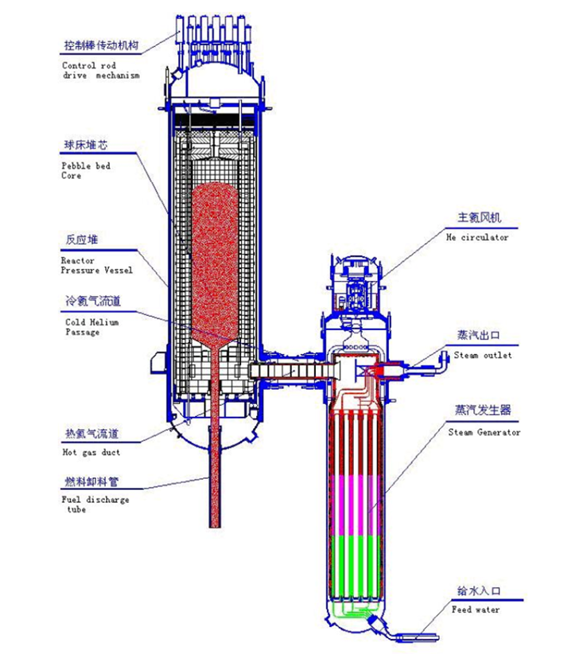

Github Repository: [SmallModularNuclearReactor](https://github.com/MichelleChung-code/SmallModularNuclearReactor)

Skills Used: [MATLAB](https://www.mathworks.com/products/matlab.html){:target="_blank"}, [Python](https://www.python.org/){:target="_blank"}

In partial fulfillment of the University of Calgary Chemical Engineering Capstone project, I worked closely with another team member to model a small modular reactor based off of China's HTR-PM model in MATLAB.

A schematic of the modular configuration of the HTR-PM reactor, steam generator, and helium circulator:

<figure>
    
    <figcaption>IAEA, "Status report 96 - High Temperature Gas Cooled Reactor - Pebble-Bed Module (HTR-PM)," 2011.</figcaption>
</figure>
