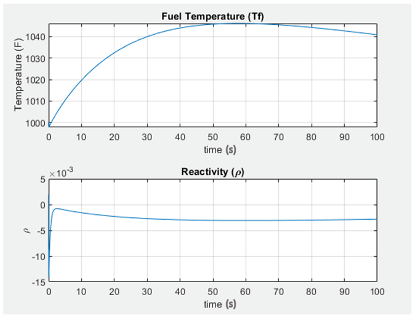

Github Repository: [SmallModularNuclearReactor](https://github.com/MichelleChung-code/SmallModularNuclearReactor)

Skills Used: [MATLAB](https://www.mathworks.com/products/matlab.html){:target="_blank"}, [Python](https://www.python.org/){:target="_blank"}

## Project Objective

In partial fulfillment of the University of Calgary Chemical Engineering Capstone project, I worked closely with another team member to model a small modular reactor based off of China's HTR-PM model in MATLAB.

A schematic of the modular configuration of the HTR-PM (High Temperature Gas-Cooled Pebble Bed Modular) reactor, steam generator, and helium circulator:

Figure Reference: IAEA, "Status report 96 - High Temperature Gas Cooled Reactor - Pebble-Bed Module (HTR-PM)," 2011.

## Reactor Description

The fuel used in the SMR is TRISO fuel elements, coated particles (three layers of pyro-carbon and one silicon carbon layer) dispersed in a graphite matrix, with an additional graphite protection layer. At the core of the coated particle is low enriched uranium as the nuclear fuel. Fresh fuel elements are enriched up to 8.77% of 235U fissile material.  The SMR operates in a multi-pass mdoe with fuel burn-up evaluated at the bottom of the reactor to either recycle the element into the reactor core or discharge it from the system.  Helium is used as the coolant.  

## Modelling Approach

SMR operation was modelled twice using two approaches:
- Preliminary model done using the Point Kinetics Equations for nuclear kinetics
- Improved model through following a nodal application

The first modelling attempt was done using the Point Kinetics Equations. These are commonly used equations in nuclear kinetics which describe the neutron flux through the changing populations of prompt and delayed neutrons in the system. This preliminary model was effective at explaining key trends. The preliminary model was successful at showing the inherent safety feature of the SMR having a net negative system temperature reactivity coefficient (a decreased reactivity with increased fuel temperature).

Temperature and reactivity trends over time for the preliminary model:

However, the Point Kinetics Equations reduces the reactor to a single point, involving the major assumption that the shape of the neutron flux and neutron density distribution can be ignored.  The large height to diameter ratio of our reactor resulted in this assumption being invalid.  

**References**
- 
