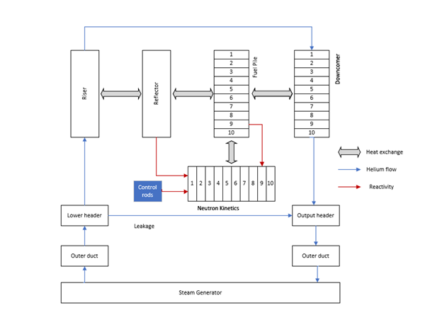
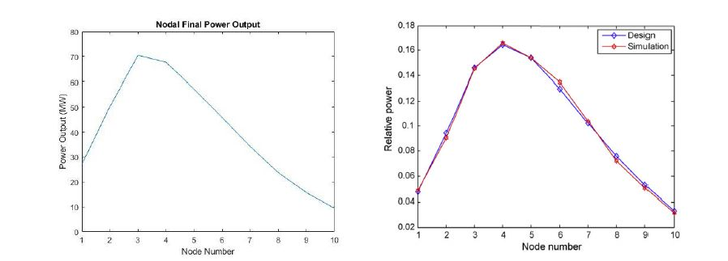
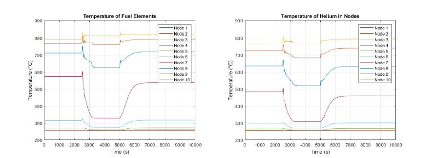
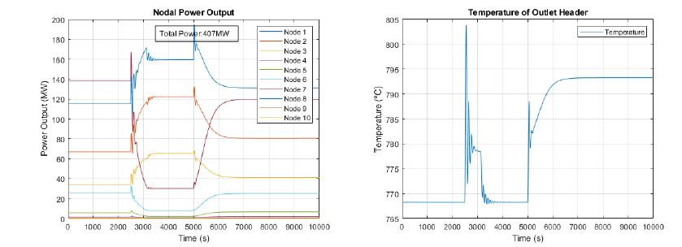
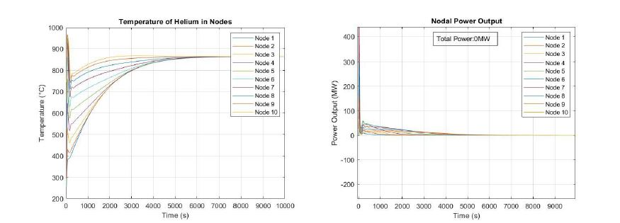

Github Repository: [SmallModularNuclearReactor](https://github.com/MichelleChung-code/SmallModularNuclearReactor)

Engineering Design Fair Website: [Using Energy from a Small Modular Nuclear Reactor to Manufacture Hydrogen](https://engineeringdesignfair.ucalgary.ca/chemical/using-energy-from-a-small-modular-reactor-to-manufacture-hydrogen/)

Skills Used: [MATLAB](https://www.mathworks.com/products/matlab.html){:target="_blank"}, [Python](https://www.python.org/){:target="_blank"}

## Project Objective

In partial fulfillment of the University of Calgary Chemical Engineering Capstone project, I worked closely with another team member to model a small modular reactor based off of China's HTR-PM model in MATLAB.

A schematic of the modular configuration of the HTR-PM (High Temperature Gas-Cooled Pebble Bed Modular) reactor, steam generator, and helium circulator:

Figure Reference: IAEA, "Status report 96 - High Temperature Gas Cooled Reactor - Pebble-Bed Module (HTR-PM)," 2011.

## Reactor Description

The fuel used in the SMR is TRISO fuel elements, coated particles (three layers of pyro-carbon and one silicon carbon layer) dispersed in a graphite matrix, with an additional graphite protection layer. At the core of the coated particle is low enriched uranium as the nuclear fuel. Fresh fuel elements are enriched up to 8.77% of 235U fissile material.  The SMR operates in a multi-pass mode with fuel burn-up evaluated at the bottom of the reactor to either recycle the element into the reactor core or discharge it from the system.  Helium is used as the coolant.  

## Modelling Approach

SMR operation was modelled twice using two approaches:
- Preliminary model done using the Point Kinetics Equations for nuclear kinetics
- Improved model through following a nodal application

The first modelling attempt was done using the Point Kinetics Equations. These are commonly used equations in nuclear kinetics which describe the neutron flux through the changing populations of prompt and delayed neutrons in the system. This preliminary model was effective at explaining key trends. The preliminary model was successful at showing the inherent safety feature of the SMR having a net negative system temperature reactivity coefficient (a decreased reactivity with increased fuel temperature).

Temperature and reactivity trends over time for the preliminary model:

However, the Point Kinetics Equations reduces the reactor to a single point, involving the major assumption that the shape of the neutron flux and neutron density distribution can be ignored.  The large height to diameter ratio of our reactor resulted in this assumption being invalid.  

A nodal approach was taken to more accurately model the reactor.  The reactor was axially split into nodes for both nuclear kinetics and thermal hydraulics.  The nodalization is depicted below:

For nuclear kinetics, within each node, the neutron flux and material composition are assumed constant. For the thermal hydraulic model, every node is considered as a lump which has constant temperature, pressure, and flow rate.  It is assumed that neutron exchange only occurs between adjacent nodes. These are considered through coupling coefficients, which depend on material composition, initial neutron flux distributions, and nodal geometry.

With the 10 node case, the shape of the power profile of the modelled reactor (left), closely resembled that of the HTR-PM literature case (right).

A control rod system and ability to observe dynamic step responses were also implemented. The control rod system provides a reactivity control mechanism for obtaining the desired power output, and also served to ensure faster reactor shut down in emergency scenarios.  The two step responses of interest were a step change in natural system reactivity and a step point change in control rod control system set point (outlet header temperature set point). The step change in natural system reactivity allowed observing how other variables reacted to a change in reactivity. For the step change in control rod control system set point, the speed at which the controller would adjust to follow the new set point was observed.

At 2500s, a step change in magnitude of 5% natural system reactivity occurs. At 5000s, a step change in controller set point by 25°C occurs.

For the responses of temperature of the fuel elements and helium:

For the responses of power output and outlet header temperature:

Lastly, the reactor shows inherently safe behaviour through automatic shutdown at high temperatures. 

**Key References**
- International Atomic Energy Agency, "Status of innovative small and medium sized reactor designs 2005," Vienna, Austria, IAEA, 2006, pp. 509-529.
- Z. Zhang, Z. Wu, D. Wang, Y. Xu, Y. Sun, F. Li and Y. Dong, "Current status and technical description of Chinese 2×250MWth HTR-PM," Nuclear Engineering and Design, vol. 239, 2009. 
- Z. Zhang, Z. Wu, Y. Sun and F. Li, "Design aspects of the Chinese modular high-temperature," Nuclear Engineering and Design, vol. 236, 2006. 
- N. K. A. M. Rashid, "Modeling nuclear processes by Simulink," AIP Conference Proceedings, vol. 1659, no. 030003, 2015. 
- Z. Dong, X. Huang and L. Zhang, "A nodal dynamic model for control system design and simulation of an MHTGR core," Nuclear Engineering and Design, vol. 240, pp. 1251-1261, 2010. 
- Z. Dong, Y. Pan, M. Song, X. Huang, Y. Dong and Z. Zhang, "Dynamic Modeling and Control Characteristics of the Two-Modular HTR-PM Nuclear Plant," Science and Technology of Nuclear Installations, vol. 2017, no. 6298037, 2017. 