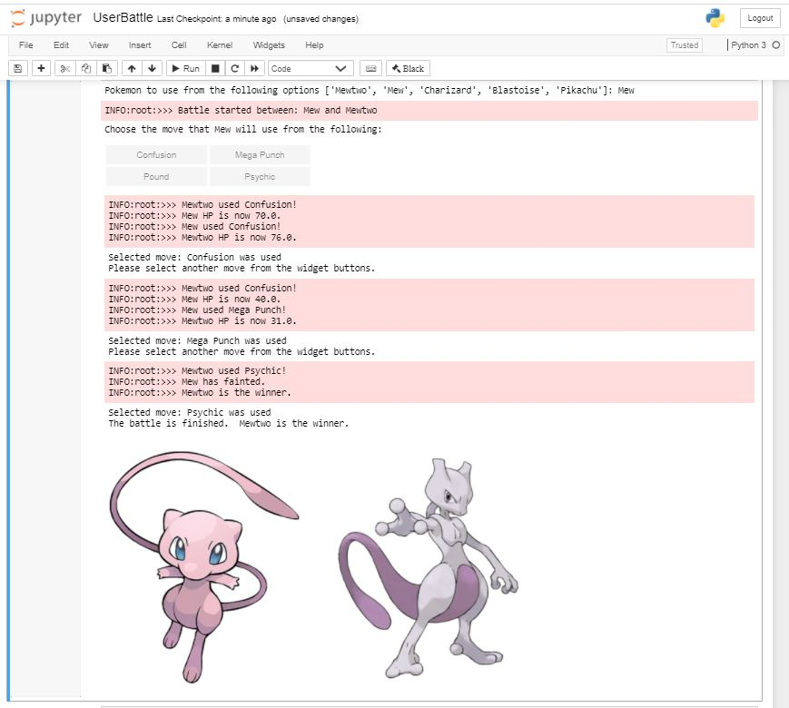

Github Repository: [PokemonAdventures](https://github.com/MichelleChung-code/PokemonAdventures)

Skills Used: [Python](https://www.python.org/){:target="_blank"}

<p align="center">
<a href="https://norekuseven.weebly.com/" target="_blank">

</a>
</p>

The above image was drawn by my younger brother, please click on it to check out his digital art website!

## Background
I've always been a huge fan of the Pokémon franchise.  This began with watching the TV series during my childhood and having "Pokémon Mystery Dungeon: Blue Rescue Team" as my first Nintendo DS game.  To date, I've played through most of the Nintendo DS/3DS games (including those from the main series,  Pokémon Ranger, and Mystery Dungeon).  More recently, I've been continuing my journey of becoming a Pokémon master through Nintendo Switch games: "Let's Go Eevee", "Sword", and "Mystery Dungeon: Rescue Team DX".  I am also the owner of the POGO AllianceCross account (friend code is 0258 2671 0038 😉).

<p align="center">

</p>

Run this in Python 3 to find out who my favourite Pokémon is!
```javascript
bytearray.fromhex("43 68 61 72 6d 61 6e 64 65 72").decode()
```

## Battle Simulation
Through using Python and Jupyter Notebook (for ipywidgets), I've implemented a simplified version of simulating a pokemon battle through using stats and moveset data.  In this, I've considered move power, accuracy, and whether moves are status-effect causing. Status effect logic has been included for when the pokemon is: paralyzed, poisoned, badly poisoned, burned, frozen, confused, infatuated, and affected by leech seed.  This was not meant to be an exact replica of the logic that the franchise follows, but more so, an exercise on how I might implement such logic. 

Implementation allows for users to manually select moves used or for automatic selection of random moves.  Opponent pokemon and moves are selected randomly from available options (Mewtwo, Mew, Charizard, Blastoise, and Pikachu - due to the moveset data I've loaded into the repo).

Current output of the [Jupyter Notebook](https://github.com/MichelleChung-code/PokemonAdventures/blob/main/src/main/python/UserBattle.ipynb):

<p align="center">

</p>

## Web Scraper
The pokemon stats information used in the battle simulation have been scraped from [Complete Pokémon Pokédex Website](https://pokemondb.net/pokedex/all) using the requests and bs4 (BeautifulSoup) packages.  Data is then cleaned and exported as a CSV file to be more usable for the battle simulation.

## More Coming Soon!